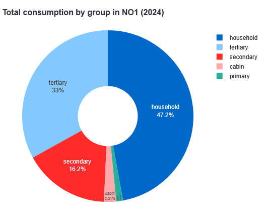
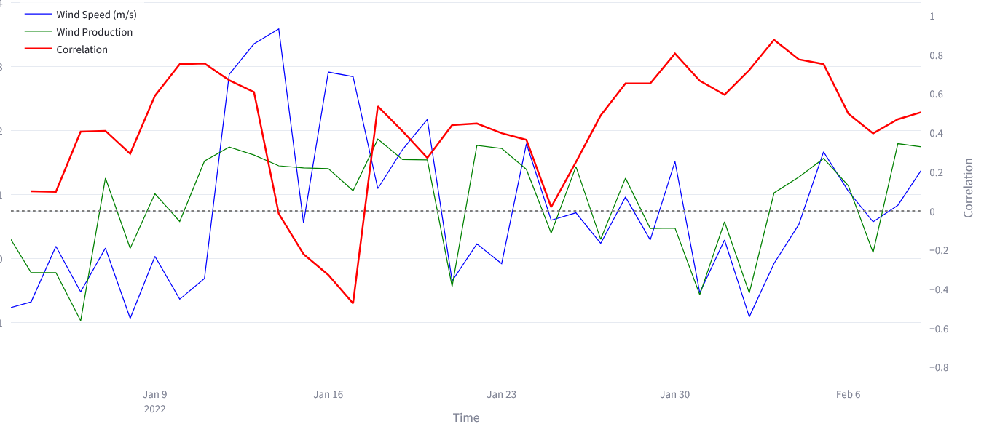
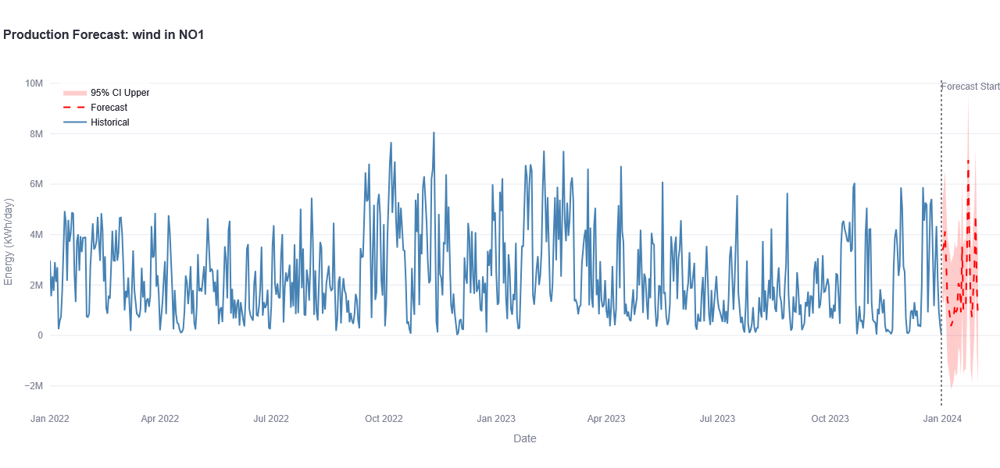
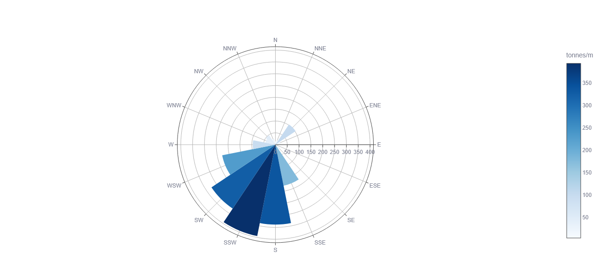
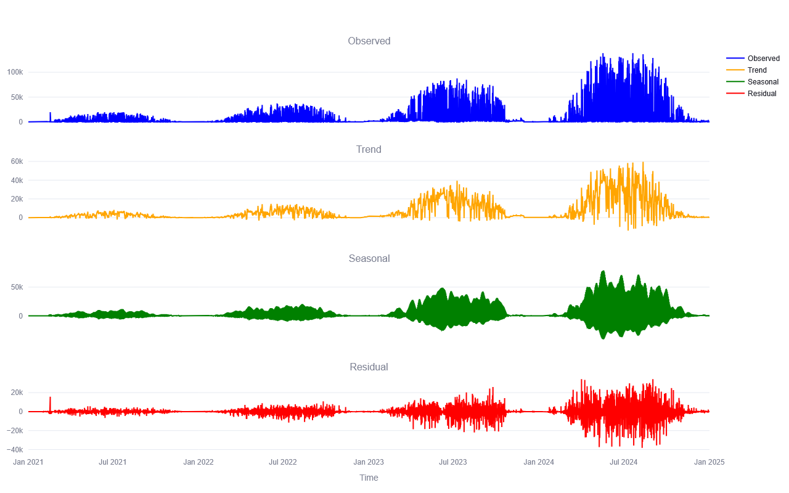
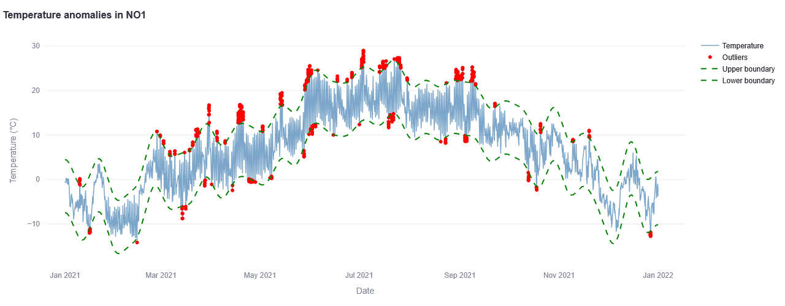

# heitonn-ind320-streamlit

🚀 **Live app**: https://heitonn-energy-dashboard.streamlit.app/

Public repository for project work in IND320, Data to Decision.

This project is a Streamlit dashboard for analysing Norwegian energy production, consumption and weather data.

---  

## ⚡ Energy & Weather Analytics Dashboard

This project is an interactive data dashboard for exploring energy production, energy consumption and weather patterns across Norwegian price areas (NO1–NO5).

The app is built with Streamlit and combines data from energy systems and weather APIs to enable exploration, analysis and forecasting.

---

## 📸 Screenshots

### Exploration – consumption breakdown


### Correlation between wind speed and production


### Forecasting – wind production


### Snow drift analysis


### Time series decomposition (STL)


### Weather anomaly detection


---

## What you can do in the app
### 🔍 Exploration

- Explore energy production and consumption
- View daily trends and seasonal patterns
- Compare across price areas NO1–NO5
- Visualise weather variables

### 📈 Analysis

- Decompose time series (trend / seasonality)
- Detect weather anomalies
- Analyse correlations between energy and weather
- Compute snow drift indicators

### 🔮 Forecasting

- Forecast energy production/consumption using SARIMAX
- Include exogenous weather variables
- Visualise prediction intervals

---


## Tech Stack
- Python  
- Streamlit  
- Pandas / NumPy  
- Plotly  
- Statsmodels (SARIMAX)  
- MongoDB  
- Open-Meteo API

---

## Run the app locally

Clone the repository:
``` bash 
git clone https://github.com/heitonn/heitonn-ind320-streamlit.git
cd heitonn-ind320-streamlit/my_streamlit_app

```

Install dependencies 
```bash 
pip install -r requirements.txt
```

Run the app
```bash 
streamlit run Energy_Dashboard.py
``` 

---

The app uses **MongoDB credentials** stored in st.secrets.

Create a .streamlit/secrets.toml file:
```TOML
[mongo]
username = "your_username"
password = "your_password"
cluster = "your_cluster"

```

---

## Data sources 
- Energy data: Elhub Energy Data API https://api.elhub.no/energy-data-api

- Weather data: Open-Meteo API https://open-meteo.com/